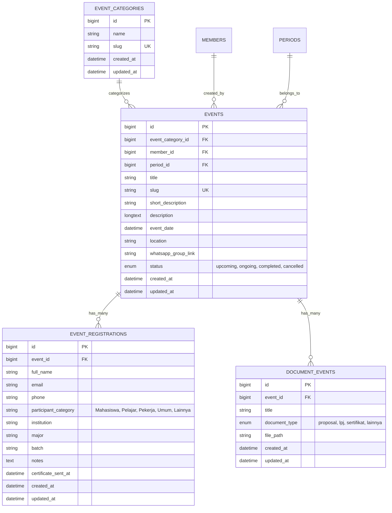

# Spesifikasi Fitur: Kegiatan (Event Management & Public Portal)

Dokumen ini merupakan panduan teknis dan fungsional komprehensif untuk **Fitur Kegiatan (Event)** pada sistem informasi HMIF UKRI, mencakup portal publik (tampilan pengguna) dan manajemen administrasi pada dashboard admin.

---

## 1. Scope (Ruang Lingkup)

Fitur Kegiatan terbagi menjadi dua ranah utama:

### A. Tampilan Depan / Public Portal (User & Pengunjung)

1. **Katalog & Agenda Kegiatan (`/kegiatan`)**
    - **Hero Section:** Banner dinamis, headline, dan pengenalan agenda kegiatan HMIF.
    - **Live Search & Filter (Alpine.js):**
        - Pencarian real-time berdasarkan judul dan deskripsi singkat.
        - Filter berdasarkan Kategori Kegiatan (Seminar, Workshop, Lomba, Pengabdian, dsb).
        - Filter berdasarkan Status Kegiatan (`Semua`, `Akan Datang / Upcoming`, `Sedang Berlangsung / Ongoing`, `Selesai / Completed`).
    - **Event Grid Cards:**
        - Thumbnail kegiatan (Spatie Media Library dengan konversi responsive).
        - Badge status (Upcoming, Ongoing, Completed, Cancelled) & badge kategori.
        - Informasi tanggal pelaksanaan, waktu, dan lokasi kegiatan.
        - Cuplikan deskripsi dan tombol CTA _Detail Kegiatan_.
    - **Empty State & State Feedback:** Tampilan informatif jika tidak ada agenda kegiatan yang sesuai filter.

2. **Halaman Detail Kegiatan (`/kegiatan/{slug}`)**
    - **Header & Cover Image:** Tampilan hero image resolusi penuh dengan badge status, kategori, dan periode kepengurusan.
    - **Informasi Utama Event:**
        - Tanggal & waktu pelaksanaan (format lokal Indonesia).
        - Lokasi (luring / daring / link platform).
        - Penanggung jawab / PIC Kegiatan (Member HMIF).
        - Countdown timer (hitung mundur waktu pelaksanaan jika berstatus upcoming).
    - **Konten & Rundown:** Rendering konten kaya teks dari Editor.js (aman dari XSS, mendukung heading, list, gambar embed, quote).
    - **Alur Pendaftaran & Presensi (RSVP):**
        - **Mode Tamu / Eksternal:** Form pendaftaran mandiri (Nama Lengkap, Email, No. WhatsApp, Kategori Peserta, Instansi, Jurusan/Prodi, Angkatan, Catatan (optional)).
        - **Mode Anggota Login (HMIF Member):** Auto-fill data profil dari database anggota, memungkinkan 1-click registration/presensi.
        - **Validasi Keterbukaan:** Pendaftaran ditutup otomatis jika event berstatus `completed` atau `cancelled`.
        - **Pencegahan Duplikasi:** 1 alamat email hanya dapat mendaftar 1 kali per kegiatan.
        - **Notifikasi & Konfirmasi Email:** Pengiriman email otomatis konfirmasi pendaftaran beserta ringkasan tiket/kegiatan via Laravel Mailable.
        - **Link Komunitas/Grup:** Menampilkan tautan bergabung grup WhatsApp kegiatan setelah pendaftaran berhasil.
    - **Quick Access Scan QR / Presensi Lokasi (`/absensi/kegiatan/{slug}`):** Route jalan pintas untuk scan QR code di lokasi acara menuju form pendaftaran/presensi.
    - **Section Kegiatan Terkait:** Rekomendasi 3 agenda kegiatan lain dalam kategori yang sama.

---

### B. Dashboard Admin & Pengurus (`/admin/events`)

1. **Daftar & Monitoring Kegiatan (`/admin/events`)**
    - Tabel/Card manajemen kegiatan dengan paginasi.
    - Filter pencarian kata kunci, kategori, dan status event.
    - Statistik ringkas total kegiatan, total pendaftar, dan kegiatan aktif.
    - Aksi cepat: _Lihat Detail & Peserta_, _Edit_, _Hapus_, dan _Buka Halaman Publik_.

2. **Form Tambah & Edit Kegiatan (`/admin/events/create` & `/admin/events/{slug}/edit`)**
    - Form Fields:
        - **Judul Kegiatan:** String, auto-generate unique slug.
        - **Kategori Kegiatan:** Dropdown relasi `event_categories`.
        - **Periode Kepengurusan:** Dropdown relasi `periods`.
        - **Deskripsi Singkat:** Teaser untuk card katalog.
        - **Waktu Pelaksanaan:** Integrasi Flatpickr (Date & Time Picker).
        - **Lokasi Pelaksanaan:** Text/URL (misal: "Aula Kampus A" atau "Zoom Meeting").
        - **Link Grup WhatsApp:** URL undangan grup koordinasi peserta.
        - **Status Kegiatan:** Enum (`upcoming`, `ongoing`, `completed`, `cancelled`).
        - **Thumbnail Banner:** Upload media Spatie (`thumbnails` collection) dengan validasi gambar (JPEG, PNG, WebP).
        - **Deskripsi Lengkap:** Editor.js rich content editor dengan endpoint upload gambar khusus.
    - **Penerbit/Author:** Auto-assign ke profil `member_id` admin/pengurus yang sedang login.

3. **Manajemen Peserta & Presensi Kegiatan (`/admin/events/{slug}`)**
    - **Ringkasan Demografi Peserta:**
        - Statistik breakdown kategori peserta (Mahasiswa, Pelajar, Pekerja, Umum).
        - Distribusi angkatan mahasiswa (normalisasi tahun angkatan).
        - Total peserta terdaftar.
    - **Tabel Data Pendaftar:**
        - Kolom: Waktu daftar, Nama, Email, No. WA, Kategori, Instansi, Jurusan, Angkatan, Catatan, Status Sertifikat.
        - Fitur Live Search data pendaftar (Nama, Email, No. WA, Instansi).
        - Aksi per peserta: Edit data pendaftar, Hapus pendaftar.
    - **Ekspor Data Pendaftar:**
        - Download data pendaftar format CSV UTF-8 (lengkap dengan escape karakter untuk format No. HP/WA agar tidak terpotong di Excel).
    - **Distribusi Sertifikat Kegiatan:**
        - **Kirim Sertifikat Perorangan:** Modal upload sertifikat, kustomisasi subjek & pesan email, langsung dikirim ke email peserta.
        - **Kirim Sertifikat Massal (Bulk Dispatch):** Chunked batch processing pengiriman sertifikat ke semua peserta terdaftar dengan tracking `certificate_sent_at`.

4. **Pengarsipan & Dokumen Pendukung (Integrasi `doc-event`)**
    - Menghubungkan Proposal & LPJ Kegiatan ke media library collection `proposals` dan `lpjs` (Private/Archive disk).

---

## 2. Database Schema & Architecture

### Detail Model & Database Constraints

- **Table `events`:**
    - Foreign key `event_category_id` -> `event_categories(id)` on delete set null.
    - Foreign key `member_id` -> `members(id)` on delete set null.
    - Foreign key `period_id` -> `periods(id)` on delete set null.
    - Index unik pada kolom `slug`.
    - Spatie Media Library Collections:
        - `thumbnails` (Single file, public disk, konversi thumbnail `thumb` 368x232).
        - `proposals` (Disk: `archives`).
        - `lpjs` (Disk: `archives`).
- **Table `event_registrations`:**
    - Foreign key `event_id` -> `events(id)` on delete cascade.
    - Unique composite index: `['event_id', 'email']` (mencegah pendaftaran ganda pada event yang sama).
    - Casts: `'certificate_sent_at' => 'datetime'`.

---

## 3. Endpoints & Route Map

### A. Public Routes (Tanpa Otentikasi)

| Method | URI                         | Controller Action                | Deskripsi                                         |
| :----- | :-------------------------- | :------------------------------- | :------------------------------------------------ |
| `GET`  | `/kegiatan`                 | `PublicEventController@index`    | Menampilkan halaman katalog & agenda kegiatan     |
| `GET`  | `/kegiatan/{slug}`          | `PublicEventController@show`     | Menampilkan detail kegiatan & form pendaftaran    |
| `POST` | `/kegiatan/{slug}/register` | `PublicEventController@register` | Menyimpan pendaftaran & mengirim email konfirmasi |
| `GET`  | `/absensi/kegiatan/{slug}`  | `Closure` (Redirect)             | URL shortcut QR code presensi menuju detail event |

### B. Admin & Pengurus Routes (`middleware: ['auth', 'role:super-admin\|pengurus']`, `prefix: admin`, `name: admin.`)

| Method   | URI                                                             | Route Name                                | Controller Action                                      | Deskripsi                                     |
| :------- | :-------------------------------------------------------------- | :---------------------------------------- | :----------------------------------------------------- | :-------------------------------------------- |
| `GET`    | `/admin/events`                                                 | `admin.events.index`                      | `AdminEventController@index`                           | Daftar tabel manajemen kegiatan               |
| `GET`    | `/admin/events/create`                                          | `admin.events.create`                     | `AdminEventController@create`                          | Form pembuatan kegiatan baru                  |
| `POST`   | `/admin/events`                                                 | `admin.events.store`                      | `AdminEventController@store`                           | Menyimpan kegiatan baru & upload media        |
| `GET`    | `/admin/events/{slug}`                                          | `admin.events.show`                       | `AdminEventController@show`                            | Detail kegiatan, statistik, & tabel pendaftar |
| `GET`    | `/admin/events/{slug}/edit`                                     | `admin.events.edit`                       | `AdminEventController@edit`                            | Form edit data kegiatan                       |
| `PUT`    | `/admin/events/{slug}`                                          | `admin.events.update`                     | `AdminEventController@update`                          | Mengupdate data kegiatan & sinkronisasi media |
| `DELETE` | `/admin/events/{slug}`                                          | `admin.events.destroy`                    | `AdminEventController@destroy`                         | Menghapus kegiatan beserta media terkait      |
| `POST`   | `/admin/events/upload-image`                                    | `admin.events.upload-image`               | `AdminEventController@uploadImage`                     | Endpoint upload gambar inline Editor.js       |
| `GET`    | `/admin/events/{slug}/registrations/export`                     | `admin.events.registrations.export`       | `AdminEventController@exportRegistrations`             | Stream download data pendaftar ke CSV         |
| `PUT`    | `/admin/events/{slug}/registrations/{registration}`             | `admin.events.registrations.update`       | `AdminEventController@updateRegistration`              | Update informasi data pendaftar               |
| `DELETE` | `/admin/events/{slug}/registrations/{registration}`             | `admin.events.registrations.destroy`      | `AdminEventController@destroyRegistration`             | Hapus peserta dari daftar pendaftaran         |
| `POST`   | `/admin/events/{slug}/registrations/{registration}/certificate` | `admin.events.registrations.certificate`  | `AdminEventController@sendRegistrationCertificate`     | Kirim sertifikat perorangan via email         |
| `POST`   | `/admin/events/{slug}/registrations/certificates`               | `admin.events.registrations.certificates` | `AdminEventController@sendAllRegistrationCertificates` | Blast sertifikat massal ke seluruh peserta    |

---

## 4. Architecture & Coding Standards

Berdasarkan [AGENT_INSTRUCTIONS.md](file:///c:/laragon/www/HMIFweb/plans/AGENT_INSTRUCTIONS.md):

1. **Skinny Controller & Request Validation:**
    - Semua input request divalidasi ketat menggunakan Form Request (`StoreEventRequest`, `UpdateEventRequest`, `RegisterEventRequest`, `CertificateRequest`).
    - Logika pemrosesan berat seperti pengiriman sertifikat massal dan parsing Editor.js didelegasikan ke Service Layer atau Action Class.
2. **Database Transactions:**
    - Semua operasi multi-tabel (pembuatan event + upload thumbnail, hapus event + media, pendaftaran + mutasi log) wajib dibungkus dalam `DB::transaction()`.
3. **Media Handling (`spatie/laravel-medialibrary`):**
    - Menggunakan `addMedia()` dan `addMediaFromRequest()` ke collection `thumbnails`.
    - Path URL thumbnail diambil via `$event->getFirstMediaUrl('thumbnails', 'thumb')`.
4. **UI & Interactivity Standards:**
    - Komponen UI menggunakan perpaduan **Tailwind CSS**, **FlyonUI**, dan **Preline UI**.
    - State interaktif frontend (filtering, search, modal pendaftaran, toggle tab, accordion) wajib menggunakan **Alpine.js**.
    - Input tanggal/waktu menggunakan **Flatpickr** dengan format standar database ISO.
    - Text editor menggunakan **Editor.js** dengan output JSON yang disanitasi saat dirender.
5. **Mailable & Notification:**
    - `App\Mail\EventRegistrationMail` untuk konfirmasi pendaftaran.
    - `App\Mail\EventCertificateMail` untuk pengiriman lampiran sertifikat PDF/PNG.
    - Menggunakan chunking (`chunk(50)`) pada pengiriman massal untuk mencegah memory limit dan worker timeout.

---

## 5. Work Breakdown Structure (Tasks & Checklist)

### Phase 1: Database & Model Layer

- [x] Migrasi tabel `events`, `event_categories`, `event_registrations`, dan `document_events`.
- [x] Implementasi interface `HasMedia` dan trait `InteractsWithMedia` pada Model `Event`.
- [x] Definisi relasi Eloquent (`category`, `member`, `period`, `registrations`, `documents`).
- [x] Konfigurasi casting atribut (`event_date`, `certificate_sent_at`).

### Phase 2: Form Requests & Business Logic

- [x] Form Request validasi pendaftaran event (guest validation & member bypass auto-fill).
- [x] Validasi admin: pembuatan & pembaruan event dengan validasi file media.
- [x] Validasi form sertifikat (mimes: pdf, jpg, png; max 10MB).
- [x] Fitur export CSV streaming dengan UTF-8 BOM dan format nomor telepon aman Excel.
- [x] Helper normalisasi tahun angkatan peserta mahasiswa.

### Phase 3: Public Frontend Experience

- [x] Layout & Banner Hero halaman `/kegiatan`.
- [x] Komponen filter interaktif Alpine.js (kategori, status, search bar).
- [x] Desain card kegiatan responsif (badge status, kategori, tanggal, lokasi).
- [x] Halaman detail kegiatan (`/kegiatan/{slug}`):
    - [x] Header, status countdown, dan metadata kegiatan.
    - [x] Renderer output Editor.js.
    - [x] Form pendaftaran & presensi (Tamu vs Anggota HMIF).
    - [x] Feedback sukses registrasi, alert email, & tombol gabung WhatsApp Group.
    - [x] Grid kegiatan terkait (Related Events).
- [x] Route shortcut QR Code scanner `/absensi/kegiatan/{slug}`.

### Phase 4: Admin Management Experience

- [x] Halaman index event admin (`/admin/events`) dengan filter & paginasi.
- [x] Halaman create & edit event dengan integrasi Editor.js & Flatpickr.
- [x] Halaman detail event & manajemen pendaftar (`/admin/events/{slug}`):
    - [x] Widget ringkasan demografi peserta (kategori & angkatan).
    - [x] Tabel pendaftar dengan pencarian instan.
    - [x] Modal & aksi edit data pendaftar.
    - [x] Modal & aksi hapus data pendaftar.
    - [x] Modal kirim sertifikat perorangan.
    - [x] Modal & alur blast sertifikat massal ke seluruh pendaftar.
    - [x] Tombol ekspor data ke format CSV.

### Phase 5: Testing & Security Hardening

- [x] Pengujian rate limiting pada endpoint pendaftaran publik untuk mencegah bot spam (throttle:10,1).
- [x] Pengujian sanitasi output XSS pada deskripsi Editor.js.
- [x] Pengujian pengiriman email pada fail-safe logging & background chunking.
- [x] Verifikasi akses role permission `super-admin` dan `pengurus` pada seluruh rute admin event.

---

## 6. Notes, Issues & Edge Cases

1. **Email SMTP Failure Handling:**
    - Pengiriman email dibungkus dalam blok `try-catch` dan dicatat ke logger (`report($exception)`) agar kegagalan SMTP pihak ketiga tidak menyebabkan crash pada respon user saat mendaftar.
2. **Karakter Nomor Telepon pada CSV:**
    - Nomor WhatsApp/HP yang diawali `08...` atau `+62...` diformat dengan tab delimiter `\t` pada CSV stream agar aplikasi spreadsheet (MS Excel / LibreOffice) tidak menghapus angka nol di awal atau mengubahnya menjadi notasi ilmiah (_scientific notation_).
3. **Penyimpanan Dokumen Sensitif:**
    - File LPJ dan Proposal kegiatan disimpan pada disk khusus `archives` dengan proteksi otorisasi, terpisah dari direktori upload media publik.
4. **Editor.js Image Clean-Up:**
    - Gambar yang diunggah saat editing draft namun tidak jadi disimpan perlu dipertimbangkan untuk pembersihan berkala (_scheduled prune_).
